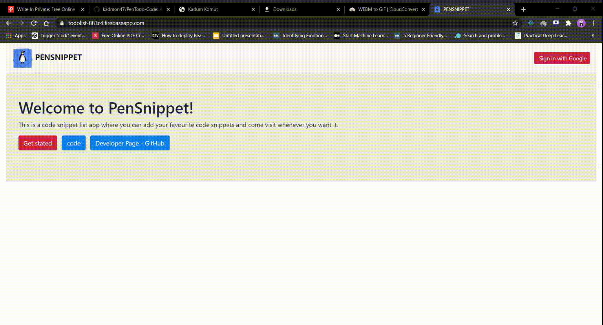

# PENSNIPPET - A WAY TO SAVE YOUR CODE AND REUSE IT

## LOGIN DEMO

## Login 

- Authentication was done using firebase authentication
- Used only for google

## WORKING DEMO

## Working

- It was done in firebase cloud database.
- Add data and remove in firebase

## Extra Libraries

- I have used react firebase
- bootstrap
- react code
- react-firebase-hooks

before running the project, be sure to add your own firebase api in the app js and npm install.
